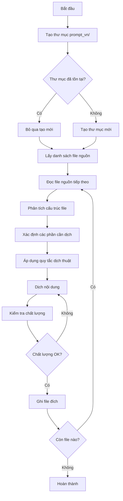

# Thiết kế Kỹ thuật: Dịch Dự án sang Tiếng Việt

## 1. Tổng quan Kiến trúc

Hệ thống dịch thuật sẽ được triển khai như một quy trình tuần tự, đọc từng file nguồn tiếng Anh, thực hiện dịch thuật với các quy tắc cụ thể cho từng loại nội dung, và ghi kết quả vào thư mục đích `prompt_vn/`. Quy trình này sẽ được thực hiện thủ công với sự hỗ trợ của AI để đảm bảo chất lượng dịch thuật cao nhất.

### Kiến trúc Tổng thể

```
Source Files (Root)          Translation Process              Target Files (prompt_vn/)
├── README.md           ──────────────────────────────>    ├── README.md
├── commit.prompt.md    ──────────────────────────────>    ├── commit.prompt.md
├── createSpec.prompt.md ─────────────────────────────>    ├── createSpec.prompt.md
├── createTask.prompt.md ─────────────────────────────>    ├── createTask.prompt.md
├── design.prompt.md    ──────────────────────────────>    ├── design.prompt.md
├── executeTask.prompt.md ────────────────────────────>    ├── executeTask.prompt.md
├── prReview.prompt.md  ──────────────────────────────>    ├── prReview.prompt.md
└── design-principle... ──────────────────────────────>    └── design-principle...
```

## 2. Sơ đồ Luồng Dữ liệu



## 3. Định nghĩa Thành phần và Giao diện

### 3.1. Cấu trúc Thư mục

```
project-root/
├── .kiro/
│   └── specs/
│       └── vietnamese-translation/
│           ├── requirements.md
│           ├── design.md
│           └── tasks.md
├── prompt_vn/                    # Thư mục đích (sẽ được tạo)
│   ├── README.md                 # File dịch
│   ├── commit.prompt.md
│   ├── createSpec.prompt.md
│   ├── createTask.prompt.md
│   ├── design.prompt.md
│   ├── executeTask.prompt.md
│   ├── prReview.prompt.md
│   └── design-principle.instructions.md
├── README.md                     # File nguồn
├── commit.prompt.md
├── createSpec.prompt.md
├── createTask.prompt.md
├── design.prompt.md
├── executeTask.prompt.md
├── prReview.prompt.md
└── design-principle.instructions.md
```

### 3.2. Quy tắc Dịch thuật

#### Quy tắc 1: Giữ nguyên YAML Frontmatter
```markdown
# File nguồn
---
mode: agent
---
# Content...

# File dịch (giữ nguyên frontmatter)
---
mode: agent
---
# Nội dung đã dịch...
```

#### Quy tắc 2: Giữ nguyên Code Blocks
```markdown
# File nguồn
```bash
git commit -m "message"
```

# File dịch (giữ nguyên code)
```bash
git commit -m "message"
```
```

#### Quy tắc 3: Dịch Nội dung Hướng dẫn
```markdown
# File nguồn
You must follow these rules:

# File dịch
Bạn phải tuân theo các quy tắc sau:
```

#### Quy tắc 4: Xử lý Thuật ngữ Kỹ thuật
```markdown
# File nguồn
The Pull Request (PR) must be reviewed.

# File dịch (giữ thuật ngữ + giải thích)
Pull Request (PR - Yêu cầu kéo) phải được xem xét.

# Hoặc (nếu thuật ngữ phổ biến)
Pull Request (PR) phải được xem xét.
```

### 3.3. Bảng Thuật ngữ Chuẩn

| English Term | Vietnamese Translation | Note |
|--------------|------------------------|------|
| Pull Request (PR) | Pull Request (PR) | Giữ nguyên, phổ biến |
| Commit | Commit | Giữ nguyên |
| Repository | Repository / Kho mã nguồn | Tùy ngữ cảnh |
| Branch | Branch / Nhánh | Tùy ngữ cảnh |
| Merge | Merge / Hợp nhất | Tùy ngữ cảnh |
| Spec-Driven Development | Phát triển theo Spec | Dịch |
| Requirements | Yêu cầu | Dịch |
| Design | Thiết kế | Dịch |
| Task | Nhiệm vụ / Task | Tùy ngữ cảnh |
| Acceptance Criteria | Tiêu chí chấp nhận | Dịch |
| User Story | User Story | Giữ nguyên |
| EARS | EARS | Giữ nguyên (tên chuẩn) |
| Agent | Agent / Tác nhân AI | Tùy ngữ cảnh |
| Prompt | Prompt | Giữ nguyên |
| Workflow | Quy trình / Workflow | Tùy ngữ cảnh |

## 4. Mô hình Dữ liệu

### 4.1. Cấu trúc File Nguồn

```typescript
interface SourceFile {
  path: string;              // Đường dẫn file nguồn
  filename: string;          // Tên file
  content: string;           // Nội dung đầy đủ
  frontmatter?: string;      // YAML frontmatter (nếu có)
  sections: Section[];       // Các phần trong file
}

interface Section {
  type: 'text' | 'code' | 'heading' | 'list' | 'table';
  content: string;
  needsTranslation: boolean;
  metadata?: Record<string, any>;
}
```

### 4.2. Cấu trúc File Đích

```typescript
interface TargetFile {
  path: string;              // Đường dẫn file đích (prompt_vn/)
  filename: string;          // Tên file (giống nguồn)
  translatedContent: string; // Nội dung đã dịch
  originalFrontmatter?: string; // YAML frontmatter gốc
  translationMetadata: {
    sourceFile: string;
    translatedDate: string;
    translator: string;
  };
}
```

## 5. Thuộc tính Đúng đắn (Correctness Properties)

*Thuộc tính đúng đắn là các đặc tính hoặc hành vi phải đúng trong mọi trường hợp thực thi của hệ thống - về cơ bản là một tuyên bố chính thức về những gì hệ thống nên làm. Các thuộc tính này đóng vai trò là cầu nối giữa đặc tả có thể đọc được bởi con người và các đảm bảo đúng đắn có thể xác minh được bởi máy.*

### Thuộc tính 1: Bảo toàn Cấu trúc File

*Đối với mọi* file nguồn được dịch, cấu trúc markdown (headers, lists, code blocks, tables) phải được giữ nguyên hoàn toàn trong file đích.

**Xác thực: Yêu cầu 2.2, 3.3, 4.2**

### Thuộc tính 2: Bảo toàn YAML Frontmatter

*Đối với mọi* file có YAML frontmatter, nội dung frontmatter phải được sao chép nguyên văn không thay đổi vào file đích.

**Xác thực: Yêu cầu 3.2, 4.2**

### Thuộc tính 3: Bảo toàn Code Blocks

*Đối với mọi* code block trong file nguồn, nội dung code phải được giữ nguyên 100% trong file đích, không có bất kỳ thay đổi nào.

**Xác thực: Yêu cầu 2.5, 3.4, 6.1**

### Thuộc tính 4: Bảo toàn Đường dẫn và URL

*Đối với mọi* URL, đường dẫn file, hoặc tham chiếu kỹ thuật trong file nguồn, chúng phải được giữ nguyên trong file đích.

**Xác thực: Yêu cầu 5.5, 6.3**

### Thuộc tính 5: Tính Nhất quán Thuật ngữ

*Đối với mọi* thuật ngữ kỹ thuật xuất hiện nhiều lần trong các file, cách dịch (hoặc giữ nguyên) phải nhất quán trong toàn bộ dự án.

**Xác thực: Yêu cầu 5.4**

### Thuộc tính 6: Tính Đầy đủ của Dịch thuật

*Đối với mọi* file nguồn trong danh sách cần dịch, phải tồn tại một file tương ứng trong thư mục `prompt_vn/` với cùng tên file.

**Xác thực: Yêu cầu 1.3, 2.4, 3.6, 4.5**

### Thuộc tính 7: Bảo toàn Lệnh Command-line

*Đối với mọi* ví dụ command-line hoặc lệnh shell trong file nguồn, lệnh phải được giữ nguyên trong file đích.

**Xác thực: Yêu cầu 6.2**

## 6. Xử lý Lỗi

### 6.1. Lỗi Tạo Thư mục

**Tình huống:** Không thể tạo thư mục `prompt_vn/` do quyền truy cập

**Xử lý:**
- Kiểm tra quyền ghi trong thư mục gốc
- Thông báo lỗi rõ ràng cho người dùng
- Dừng quy trình và yêu cầu khắc phục

### 6.2. Lỗi Đọc File Nguồn

**Tình huống:** File nguồn không tồn tại hoặc không đọc được

**Xử lý:**
- Ghi log file bị lỗi
- Tiếp tục với file tiếp theo
- Báo cáo danh sách file lỗi ở cuối

### 6.3. Lỗi Ghi File Đích

**Tình huống:** Không thể ghi file vào thư mục `prompt_vn/`

**Xử lý:**
- Kiểm tra quyền ghi
- Thử lại một lần
- Nếu thất bại, ghi log và tiếp tục

### 6.4. Lỗi Encoding

**Tình huống:** File có encoding không phải UTF-8

**Xử lý:**
- Thử detect encoding tự động
- Chuyển đổi sang UTF-8
- Nếu thất bại, báo lỗi và bỏ qua file

## 7. Chiến lược Kiểm thử

### 7.1. Unit Tests

**Mục tiêu:** Kiểm tra các chức năng riêng lẻ

**Các test case:**
- Test tạo thư mục `prompt_vn/`
- Test đọc file nguồn
- Test phân tích YAML frontmatter
- Test phát hiện code blocks
- Test ghi file đích
- Test xử lý encoding

### 7.2. Property-Based Tests

**Mục tiêu:** Xác minh các thuộc tính đúng đắn trên nhiều đầu vào

**Cấu hình:**
- Sử dụng thư viện: fast-check (cho TypeScript/JavaScript) hoặc Hypothesis (cho Python)
- Số lần lặp tối thiểu: 100 lần mỗi property test

**Các property tests:**

#### Test 1: Bảo toàn Cấu trúc Markdown
```typescript
// Feature: vietnamese-translation, Property 1: Bảo toàn Cấu trúc File
// Validates: Requirements 2.2, 3.3, 4.2
```
Tạo ngẫu nhiên các file markdown với cấu trúc khác nhau, dịch chúng, và xác minh rằng số lượng headers, lists, code blocks giống nhau.

#### Test 2: Bảo toàn YAML Frontmatter
```typescript
// Feature: vietnamese-translation, Property 2: Bảo toàn YAML Frontmatter
// Validates: Requirements 3.2, 4.2
```
Tạo ngẫu nhiên các file với YAML frontmatter khác nhau, dịch chúng, và xác minh frontmatter không thay đổi.

#### Test 3: Bảo toàn Code Blocks
```typescript
// Feature: vietnamese-translation, Property 3: Bảo toàn Code Blocks
// Validates: Requirements 2.5, 3.4, 6.1
```
Tạo ngẫu nhiên các file với code blocks, dịch chúng, và xác minh nội dung code giống hệt nhau.

#### Test 4: Bảo toàn URL và Đường dẫn
```typescript
// Feature: vietnamese-translation, Property 4: Bảo toàn Đường dẫn và URL
// Validates: Requirements 5.5, 6.3
```
Tạo ngẫu nhiên các file chứa URLs và file paths, dịch chúng, và xác minh chúng không thay đổi.

#### Test 5: Tính Đầy đủ
```typescript
// Feature: vietnamese-translation, Property 6: Tính Đầy đủ của Dịch thuật
// Validates: Requirements 1.3, 2.4, 3.6, 4.5
```
Với danh sách file nguồn, sau khi dịch, xác minh rằng mọi file đều có file tương ứng trong `prompt_vn/`.

### 7.3. Integration Tests

**Mục tiêu:** Kiểm tra quy trình dịch từ đầu đến cuối

**Các test case:**
- Test dịch toàn bộ dự án từ đầu
- Test dịch khi thư mục đích đã tồn tại
- Test xử lý file có lỗi
- Test với các loại file khác nhau

### 7.4. Manual Quality Assurance

**Mục tiêu:** Đảm bảo chất lượng dịch thuật bằng mắt người

**Quy trình:**
1. Đọc từng file đã dịch
2. Kiểm tra tính tự nhiên của ngôn ngữ
3. Xác minh ý nghĩa kỹ thuật được bảo toàn
4. Kiểm tra tính nhất quán thuật ngữ
5. Xác minh formatting và cấu trúc

## 8. Cân nhắc Bảo mật

### 8.1. Quyền Truy cập File

- Đảm bảo quyền đọc cho tất cả file nguồn
- Đảm bảo quyền ghi cho thư mục đích
- Không thay đổi quyền của file gốc

### 8.2. Xử lý Nội dung Nhạy cảm

- Không dịch hoặc sửa đổi bất kỳ thông tin nhạy cảm nào (nếu có)
- Giữ nguyên tất cả API keys, tokens trong ví dụ (nếu có)

### 8.3. Encoding và Character Set

- Sử dụng UTF-8 cho tất cả file đích
- Đảm bảo hỗ trợ đầy đủ ký tự tiếng Việt có dấu
- Xử lý đúng các ký tự đặc biệt trong markdown

## 9. Kế hoạch Triển khai

### Giai đoạn 1: Chuẩn bị
1. Tạo thư mục `prompt_vn/`
2. Xác định danh sách file cần dịch
3. Chuẩn bị bảng thuật ngữ chuẩn

### Giai đoạn 2: Dịch File Cơ bản
1. Dịch `README.md`
2. Xem xét và điều chỉnh nếu cần

### Giai đoạn 3: Dịch Các File Prompt
1. Dịch `commit.prompt.md`
2. Dịch `createSpec.prompt.md`
3. Dịch `createTask.prompt.md`
4. Dịch `design.prompt.md`
5. Dịch `executeTask.prompt.md`
6. Dịch `prReview.prompt.md`

### Giai đoạn 4: Dịch File Hướng dẫn
1. Dịch `design-principle.instructions.md`

### Giai đoạn 5: Kiểm tra Chất lượng
1. Xem xét toàn bộ các file đã dịch
2. Kiểm tra tính nhất quán
3. Sửa lỗi nếu có

### Giai đoạn 6: Hoàn thiện
1. Kiểm tra lần cuối
2. Commit và push code
